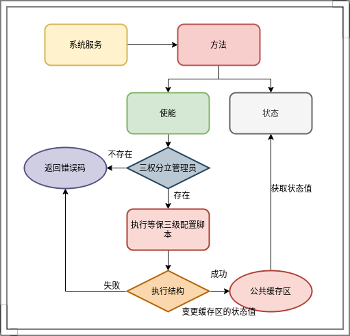
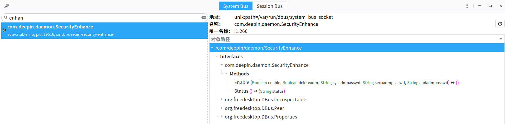

[TOC]

# com.deepin.daemon.SecurityEnhance 服务

Bus：system

程序：/usr/sbin/deepin-security-enhance

功能：等保三级开关接口

流程：



样式：



## com.deepin.daemon.SecurityEnhance 对象

实例数量：1

路径：/com/deepin/daemon/SecurityEnhance

### com.deepin.daemon.SecurityEnhance 接口

#### **方法**

##### Enable

```
Enable(enable boolean,deleteadm boolean,sysadmpasswd string,secadmpasswd string,audadmpasswd string) -> ()
```

打开/关闭 等保三级开关

**参数**

- enable：开/关
- deleteadm：三权管理员账户管控，true删除原有的三权管理员账户，false为不处理
- sysadmpasswd：管理员密码
- secadmpasswd：管理员密码
- audadmpasswd：管理员密码

**注意**

- enable参数值为true，deleteadm参数值为false时，调用前需确保三权分立账户不存在，若存在则返回错误消息`Three rights separation user already exists`；可将此消息作为特殊错误码，接收到这个特殊错误码后提示用户删除 或者 强制开启。
- enable，deleteadm参数值为true时，将不去判断三权管理员用户是否存在，强制进行等保三级状态的打开。
- 传入开关状态参数不能和之前开关状态一致

------

##### Status

```
Status() -> (string status)
```

获取等保三级开关状态

**返回值**

- status：开关状态

**注意**

- 返回状态有四种：
  - opening：开启中
  - open：开启
  - closing：关闭中
  - close：关闭

------

##### SetLabel

```
SetLabel(label_type int, device_type int, label string) -> ()
```

重新设置对应标签类型、设备类型下标签值

**参数**

- label_type：挂载标签类型；暂定两种类型值，⽤int值代指具体内容：
  - 1：`rootcontext`
  - 2：`defcontext`

- device_type：设备类型；暂定两种类型：
  - 1：可移动介质
  - 2：磁盘

- label：标签值

**注意**

- 此接口⽤于内部更改替换配置⽂件内容，不对外使⽤

------

##### GetLabel

```
GetLabel(device_type int) -> (labels string)
```

获取等保三级开关状态

**参数**

- device_type：设备类型，具体内容同上

**返回值**

- label：标签值（例： `rootcontext="system_u:object_r:usbfs_t:s0",defcontext="system_u:object_r:remova ble_t:s0"` ）

**注意**

- 当输⼊参数错误时返回的值固定为null
- 返回的标签值默认rootcontext总放在前⾯；当某个挂载类型不存在在对应值时，将只返回存在的 挂载类型值；若都不存在时，将返回null值

------

##### GetSEUserByName

```
GetSEUserByName(linuxuser string) -> (seuser string, level string)
```

检索与给定 Linux 用户名关联的 SELinux 用户名和安全级别

**参数**

- linuxuser：linux用户名

**返回值**

- seuser：selinux用户名
- level：安全级别

**注意**

- 未开启等保的情况下返回安全级别默认为空